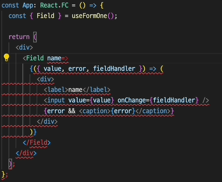
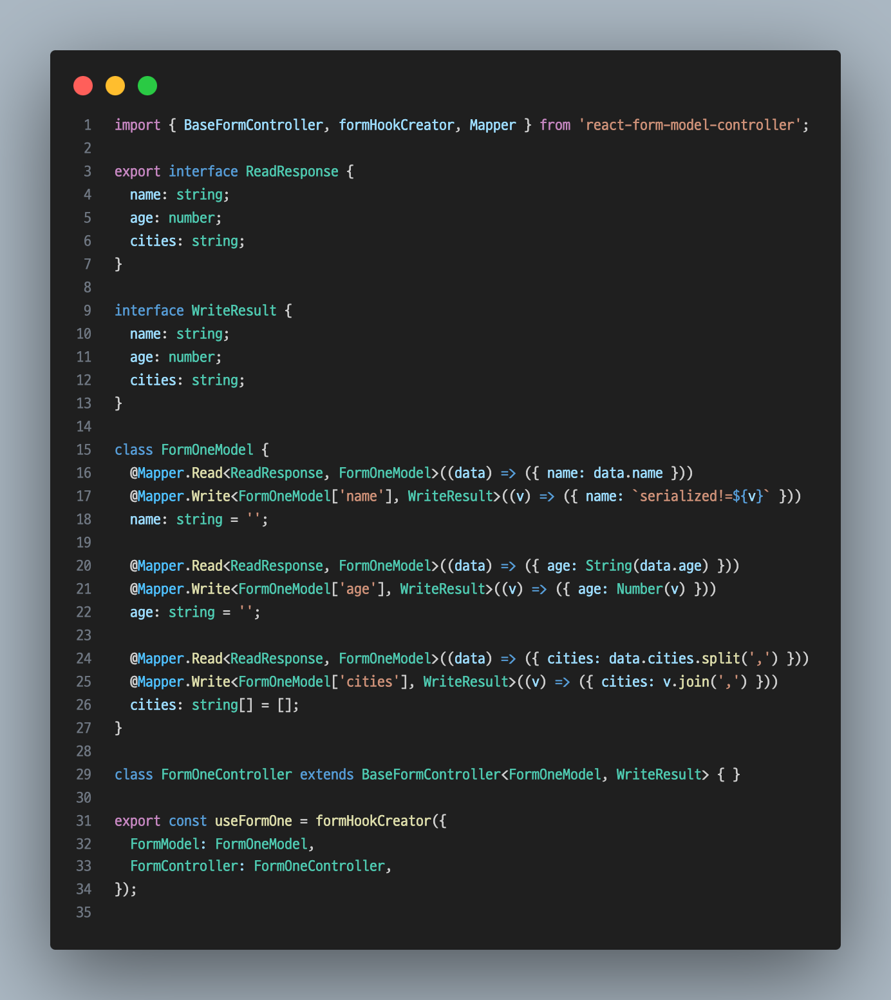
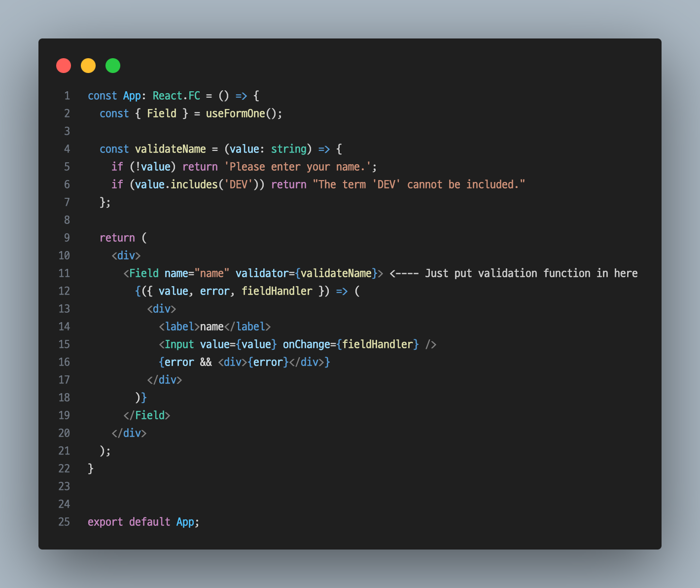
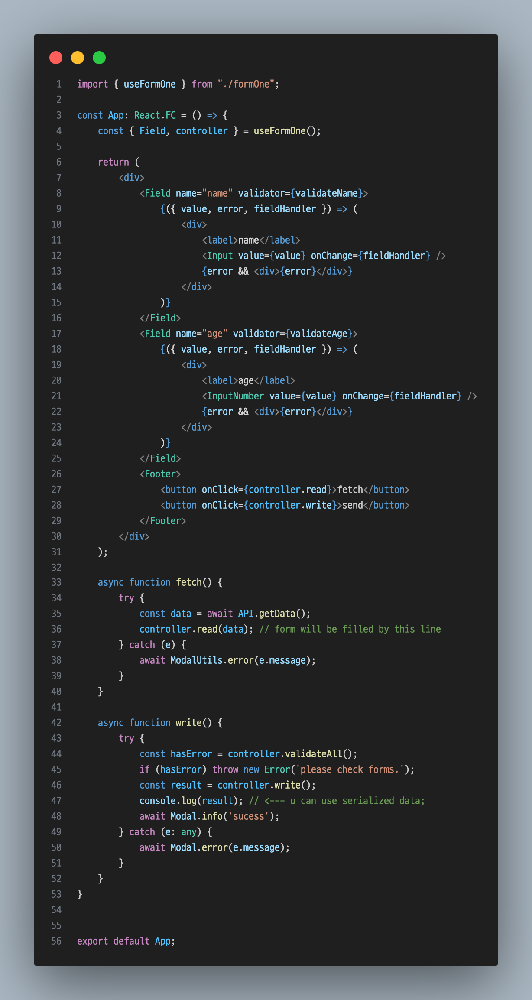

# react-form-model-controller
Boosts productivity through TypeScript IDE support, streamlines data serialization/deserialization and validation, and offers customizable UI with render props for seamless server communication. A class model-based React form system utilizing decorators and metadata reflection.

## Description
This form system enhances productivity with TypeScript IDE support, simplifies data serialization/deserialization and validation, and provides customizable UI with render props for seamless server communication.

## Demo
- https://cicada1992.github.io/react-form-model-controller/

## Get Started
- `npm install react-form-model-controller`
- `yarn add react-form-model-controller`
- `pnpm add react-form-model-controller`

## Features

#### Fully Supported TypeScript
- Our form system is built with full TypeScript support, ensuring that you can take full advantage of IDE assistance. This means better code completion, error detection, and overall productivity enhancements as you build your forms.

#### Frees you from dealing with server-side data interface changes
- Say goodbye to the headaches of data serialization and deserialization. With our Mapper decorators, you can separate concerns between UI and server data handling. This allows you to focus solely on the UI, making your code more maintainable and adaptable to server changes without any hassle
- Has mapper layer for data serialization/deserialization. just annotated @Mapper.Read / @Mapper.Write.

#### Built-in Validation
- Form validation is a critical aspect of any form management system. Our library comes with built-in validation support, ensuring your forms handle user input correctly and efficiently. You can define your validation logic and put it in to Field componet validator prop.

#### Customizable UI with Render Props
- Flexibility is at the core of our system. Using the render props pattern, you can tailor the UI to meet your specific needs. Whether you need a simple form or a complex, highly customized interface, our system provides the tools to make it happen.

## Basic Usage
1. Define model and create hook.

2. Use created hook in your component.

## Caveat
- Check your codebase settings(env) for decorator syntax.

## APIS
### Field Component Props

| Target           | Description                                                                                       | Type                                      | Required  |
|------------------|---------------------------------------------------------------------------------------------------|-------------------------------------------|-----------|
| name             | Name of the field defined in the model                                                            | string                                    | required  |
| refValues        | Fields that will trigger re-rendering and are included in the values                              | Array<keyof TFormModel>                   | optional  |
| validator        | Function to validate the field                                                                    | (value: T) => string \| null \| undefined | optional  |
| validateOnMount  | Whether to validate the field when it is mounted                                                  | boolean                                   | optional  |

### Field Component Children Arguments (Render-Props Arguments)

| Target                 | Description                                                                                         | Type                                                   |
|------------------------|-----------------------------------------------------------------------------------------------------|--------------------------------------------------------|
| value                  | Value of the field                                                                                  | TValue                                                 |
| values                 | Values of the fields passed in refValues                 | Partial<TFormModel>                                    |
| error                  | Error message                                                                                       | string \| undefined \| null                            |
| fieldHandler           | Handler for the field corresponding to the Field component                                          | (TValue) => void                                       |
| getFieldHandler        | Getter for a specific field handler                                                                 | (key: TKey, value: TFormModel[TKey]) => void           |
| getComplexFieldHandler | Getter for a handler used in complex field settings                                                 | (key: TKey, path: string (inferred by TypeScript), value: TValue) => void |

### Controller

| Target        | Description                                                                                      | Type                                                     |
|---------------|--------------------------------------------------------------------------------------------------|----------------------------------------------------------|
| setValue      | Update the value of a specific field                                                             | (key: TKey, value: TFormModel[TKey]) => void             |
| setValues     | Update the entire model                                                                          | (values: TFormModel) => void                             |
| validate      | Validate a specific field                                                                        | (key: TKey) => boolean                                   |
| validateAll   | Validate all fields                                                                              | (key: TKey, value: TFormModel[TKey]) => boolean          |
| undo          | Undo the update (experimental)                                                                   | () => void                                               |
| reset         | Reset the form                                                                                   | () => void                                               |
| read          | Fetch data from the server, convert to the model, and set the form                               | (read: DataResponse) => void                             |
| write         | Convert model data to the interface expected by the server                                       | () => WriteResult(server expected data)                  |